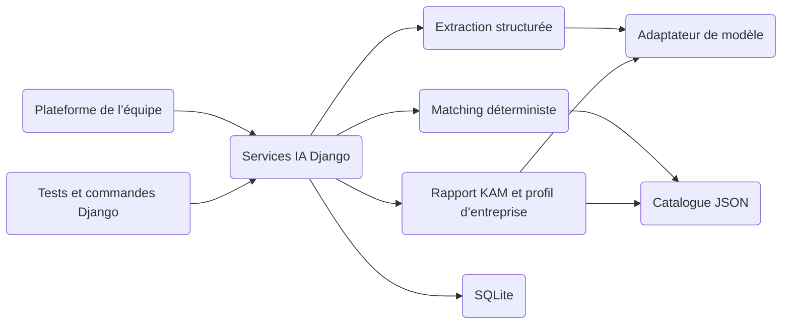

# Architecture Brief — Onbora AI V1

<!-- architecture-section: executive-verdict -->
## Executive Verdict

- **Recommendation :** construire un module IA dans une application Django utilisant SQLite. Le module extrait un profil d’entreprise depuis une conversation, rapproche ce profil d’un petit catalogue de services, puis génère un rapport KAM et un profil d’entreprise exportable.
- **Pourquoi cela convient :** l’équipe n’attend pas une plateforme complète de la personne responsable de l’IA. Django fournit l’intégration et la persistance nécessaires, SQLite suffit pour les essais à faible concurrence, et un fichier JSON suffit pour un catalogue de 5 à 8 services.
- **Risque principal :** produire des rapports convaincants mais fondés sur des informations inventées, mal extraites ou sur un catalogue métier incomplet.
- **Décisions prises maintenant :** Django, SQLite, pipeline IA borné, catalogue léger, recommandations explicables et rapports structurés.
- **Peut attendre :** PostgreSQL, pgvector, React, authentification avancée, workers, cloud, multi-tenant, CRM, voix, recherche web et RAG vectoriel.
- **Confiance :** élevée pour une V1 de laboratoire et d’intégration interne ; moyenne tant que le catalogue réel et des exemples de rapports acceptables ne sont pas fournis.

<!-- architecture-section: project-frame -->
## Cadre du projet

### Objectifs

- **REQ-001 — Profil d’entreprise :** transformer une conversation en description structurée, sourcée et révisable de l’entreprise.
- **REQ-002 — Informations manquantes :** identifier les éléments utiles qui n’ont pas encore été fournis et proposer les prochaines questions.
- **REQ-003 — Opportunités :** identifier ce qui peut être intéressant pour l’entreprise à partir d’un catalogue métier approuvé.
- **REQ-004 — Rapport KAM :** produire une synthèse exploitable qui distingue les faits rapportés, les inférences et les points à vérifier.
- **REQ-005 — Profil d’entreprise descriptif :** générer une représentation structurée de l’entreprise, de ses activités, de ses implantations, de ses besoins et de ses contraintes, sans recommandation ni prédiction.
- **REQ-006 — Intégration :** exposer les traitements IA sous forme de services Python/Django que les autres membres de l’équipe peuvent appeler depuis la plateforme.
- **REQ-007 — Évaluation :** vérifier les résultats sur un petit corpus de conversations synthétiques et reproductibles.

### Hors périmètre de cette V1

- Construction de la plateforme web complète ou d’un frontend React.
- Authentification, permissions multi-tenant et administration métier avancée.
- PostgreSQL, pgvector, base vectorielle, broker ou worker distribué.
- Déploiement cloud, haute disponibilité, sauvegardes de production et observabilité avancée.
- CRM, WhatsApp, voix, recherche web et enrichissement automatique d’entreprise.
- KYC/KYB, données réglementées, prix contractuels ou activation automatique d’un service.
- Agent autonome capable d’exécuter librement des outils.

### Contraintes confirmées

- La responsabilité actuelle porte sur l’IA et les rapports, pas sur toute la plateforme.
- Le projet s’intègre à un travail d’équipe ; les autres couches peuvent être réalisées par d’autres personnes.
- Django et SQLite sont suffisants pour le laboratoire et les démonstrations initiales.
- Le profil d’entreprise est une description sourcée, distincte de la recommandation commerciale portée par le rapport KAM.
- Les premiers essais utilisent uniquement des données fictives ou explicitement anonymisées.
- Le catalogue initial reste petit et peut être chargé directement depuis des fichiers versionnés.

<!-- architecture-section: evidence-and-assumptions -->
## Éléments établis, hypothèses et inconnues

| Élément | Type | Confiance | Impact si incorrect | Validation |
|---|---|---:|---|---|
| Django et SQLite sont le socle souhaité | Décision utilisateur | Élevée | Changerait le bootstrap et la persistance | Validé par le porteur IA |
| Le périmètre se limite à l’IA et aux rapports | Décision utilisateur | Élevée | Réintroduirait une plateforme beaucoup plus large | Validé par le porteur IA |
| Le profil d’entreprise ne contient aucune recommandation | Décision utilisateur | Élevée | Mélangerait description et décision commerciale | Valider les premiers exemples |
| Le catalogue contient environ 5 à 8 services | Hypothèse | Moyenne | Affecte le moteur de rapprochement | Importer le catalogue réel |
| La concurrence d’écriture reste faible | Hypothèse | Moyenne | SQLite pourrait devenir limitant | Observer les erreurs de verrouillage et le nombre d’utilisateurs |
| L’équipe appelante peut consommer un service Python/Django | Hypothèse | Moyenne | Peut imposer une API HTTP plus tôt | Valider le contrat d’intégration avec l’équipe |
| Gemini est le fournisseur réel pressenti | Décision utilisateur | Élevée | Affecte qualité, coût et politique de données | Fake local puis adaptateur `google-genai` étroit |

<!-- architecture-section: critical-flows -->
## Flux critiques

### 1. Extraire et mettre à jour le profil

1. Le service reçoit l’identifiant de conversation et le nouveau message.
2. Le message est stocké dans SQLite avant l’appel externe.
3. Le modèle reçoit le message, l’historique récent borné, le profil courant et un schéma de sortie strict.
4. Il retourne un `QualificationTurnOutput` contenant la réponse conversationnelle et un `CompanyProfilePatch` avec valeurs, sources et niveau de certitude.
5. Le résultat est validé ; une sortie invalide n’est pas appliquée.
6. Le service fusionne le patch sans remplacer silencieusement une information confirmée.
7. Le profil mis à jour et les informations manquantes sont enregistrés.

En cas d’échec du fournisseur, le message reste disponible, le profil précédent reste intact et l’erreur est présentée comme réessayable.

### 2. Identifier les opportunités

1. Le service charge le profil validé et la version du catalogue.
2. Un moteur Python applique les prérequis, exclusions et correspondances définis dans le catalogue.
3. Il retourne des opportunités, des raisons lisibles et les informations encore nécessaires.
4. Le modèle peut reformuler l’explication, mais il ne peut pas ajouter un service absent du résultat déterministe.

### 3. Générer les rapports

1. Le rapport KAM et le profil exportable utilisent les mêmes faits validés; les opportunités restent exclusivement dans le rapport KAM.
2. Les sorties respectent des schémas JSON versionnés.
3. Les faits, inférences, incertitudes et informations manquantes restent distincts.
4. Une version texte ou HTML peut être rendue depuis le JSON sans devenir une nouvelle source de vérité.

### 4. Évaluer une configuration

1. Un test charge une conversation synthétique, le résultat attendu et une configuration de modèle.
2. Le pipeline complet est exécuté sans interface web obligatoire.
3. Les validateurs mesurent la validité du schéma, les faits extraits, les services autorisés, les inventions et la complétude des rapports.
4. Le rapport de test conserve les versions du prompt, du modèle et du catalogue.

<!-- architecture-section: quality-scenarios -->
## Scénarios de qualité

| ID | Contexte et stimulus | Réponse mesurable | Statut | Preuve attendue |
|---|---|---|---|---|
| NFR-001 | Le modèle retourne un JSON invalide | Aucun profil ou rapport invalide n’est enregistré | Proposé | Tests avec réponses malformées |
| NFR-002 | Un fait contredit le profil existant | Les deux valeurs restent visibles et le conflit est signalé | Proposé | Tests de fusion |
| NFR-003 | Le modèle propose un service inconnu | La sortie est rejetée ou marquée non finale | Proposé | Test d’allowlist |
| NFR-004 | Le fournisseur est indisponible | Le profil précédent reste intact et le traitement est réessayable | Proposé | Fake en erreur/timeout |
| NFR-005 | Le même traitement est relancé | Aucun message ou rapport identique n’est dupliqué | Proposé | Test d’idempotence simple |
| NFR-006 | Un rapport contient une affirmation importante | L’affirmation est reliée au profil, au catalogue ou marquée comme inférence | Proposé | Vérification de provenance |
| NFR-007 | La suite synthétique est exécutée | 100 % des objets persistés respectent leur schéma et aucun service inconnu n’est recommandé | Proposé | Gate Pytest |

<!-- architecture-section: architecture -->
## Architecture

### Contexte



Le fournisseur de modèle est la principale frontière externe. Les messages, documents et réponses du modèle sont des données non fiables qui doivent être validées avant d’être enregistrées ou affichées.

### Composants et responsabilités

| Composant | Responsabilité | Données possédées | Entrées/sorties | Dépendances autorisées | Comportement en échec |
|---|---|---|---|---|---|
| Services Django | Cas d’usage appelés par la plateforme | Conversations et résultats | Commandes Python/DTO | Domaine, ORM, adaptateurs | Erreur typée, état précédent conservé |
| Contrats IA | Schémas et invariants | Versions de schéma | JSON validé | Python/Pydantic | Rejet de la sortie invalide |
| Extracteur | Construire un patch sourcé | Prompts d’extraction | Message + profil → patch | Port `ChatModel` | Aucun changement de profil |
| Fusion de profil | Appliquer les faits et conflits | Règles de fusion | Profil + patch → profil | Contrats purs | Conflit explicite |
| Matching | Identifier les services intéressants | Règles déterministes | Profil + catalogue → opportunités | Python pur | `needs_information` ou `no_match` |
| Générateurs de rapports | Produire KAM et profil d’entreprise | Prompts et gabarits | Profil validé, avec opportunités pour KAM uniquement | Contrats, modèle optionnel | Rapport non final ou absent |
| Adaptateur de modèle | Isoler le SDK du fournisseur | Configuration du modèle | Requête interne → sortie normalisée | SDK fournisseur | Timeout et erreur typés |
| ORM Django | Persistance locale | Messages, profils, résultats, exécutions | Modèles Django | SQLite | Transaction annulée |

### Structure cible

```text
onbora-mvp/
  manage.py
  config/
  apps/
    ai_core/
      contracts/             # Schémas de profil, patch et recommandations
      domain/                # Fusion, matching et règles pures
      services/              # Cas d’usage Django
      providers/             # Fake et adaptateur LLM
      models.py              # Persistance SQLite
      tests/
    reports/
      contracts/             # KAM et profil d’entreprise
      services/              # Génération et rendu
      tests/
  catalog/                   # Services et règles JSON versionnés
  prompts/                   # Prompts versionnés
  evals/                     # Conversations synthétiques et attentes
  docs/
```

Le domaine de fusion et de matching ne dépend ni de Django ni du SDK du fournisseur. Les services Django orchestrent le domaine, la persistance et les adaptateurs externes.

<!-- architecture-section: data-and-contracts -->
## Données et contrats

### Source de vérité

- SQLite est la source opérationnelle pour les essais locaux.
- Git est la source de vérité révisable pour le catalogue, les prompts, les schémas et les scénarios d’évaluation.
- Chaque résultat conserve `schema_version`, `catalog_version`, `prompt_version` et `model_config`.

### Modèles Django minimaux

| Modèle | Utilité | Données principales |
|---|---|---|
| `Conversation` | Regrouper un essai | statut, timestamps, métadonnées minimales |
| `Message` | Historique d’entrée/sortie | rôle, contenu, statut, clé d’idempotence |
| `CompanyProfileSnapshot` | Profil après traitement | JSON validé, sources, version |
| `RecommendationResult` | Opportunités déterministes | items, raisons, informations manquantes, version du catalogue |
| `GeneratedReport` | KAM ou profil d’entreprise | type, JSON validé, rendu optionnel, statut |
| `AIExecution` | Diagnostic minimal | but, modèle, prompt, durée, statut, erreur et usage sans secret |

Les champs structurés variables peuvent utiliser `models.JSONField`, pris en charge avec SQLite. Les relations et les identifiants restent des colonnes normales.

### Contrat minimal du profil d’entreprise

```json
{
  "schema_version": "1.0",
  "status": "final",
  "description": "Entreprise Exemple évolue dans le secteur education et exerce une activité de formation professionnelle à Kinshasa.",
  "company_summary": {
    "name": "Entreprise Exemple",
    "sector": "education",
    "activities": [
      "formation professionnelle"
    ],
    "size": "small_business",
    "locations": [
      "Kinshasa"
    ]
  },
  "needs": [],
  "constraints": [],
  "missing_information": [],
  "sources": []
}
```

Les besoins et contraintes acceptent des éléments structurés portant au minimum une description, un statut (`reported`, `inferred`, `confirmed`, `unknown`) et des références de source. Une déclaration directe est `reported`; elle devient `confirmed` uniquement après une confirmation explicite. Une inférence ne remplace jamais un fait rapporté ou confirmé. Le contrat exclut explicitement opportunités, services et prochaines actions.

### Interface avec le reste de l’équipe

La première interface est un service Python stable, par exemple :

```python
process_conversation_turn(conversation_id, text, idempotency_key) -> TurnResult
generate_report(conversation_id, report_type) -> GeneratedReportResult
```

Une vue Django ou une API HTTP pourra envelopper ces services sans déplacer la logique métier. Les DTO de sortie restent indépendants des modèles ORM.

<!-- architecture-section: trust-and-security -->
## Confiance et sécurité

- Les données réelles ne sont pas nécessaires pour développer la V1 ; utiliser des entreprises fictives ou anonymisées.
- Les clés fournisseur viennent des variables d’environnement et ne sont jamais stockées dans SQLite, les prompts, les rapports ou les logs.
- Les sorties du modèle sont validées par schéma et limitées en taille.
- Les rapports ne présentent jamais une inférence comme un fait certain.
- Les appels au modèle utilisent un timeout et un nombre borné de tentatives.
- L’authentification et les permissions appartiennent à la plateforme de l’équipe ; le module IA ne doit pas inventer son propre modèle multi-tenant.

<!-- architecture-section: deployment-and-operations -->
## Déploiement et exploitation

- **Topologie initiale :** un processus Django et un fichier SQLite dans l’environnement de développement ou de démonstration.
- **Observabilité minimale :** statut, durée, modèle, version de prompt, usage et code d’erreur dans `AIExecution`; aucun contenu sensible dans les logs techniques.
- **Récupération :** en cas d’échec du modèle, conserver le dernier profil valide et permettre un retry explicite.
- **Livraison :** migrations Django, tests Pytest/Django et commande de démonstration reproductible.
- **Limite assumée :** SQLite n’est pas destiné ici à plusieurs écritures concurrentes soutenues ni à une exploitation publique à forte charge.

<!-- architecture-section: decisions-and-trade-offs -->
## Décisions et compromis

| Décision | Options considérées | Recommandation | Pourquoi | Signal d’invalidation |
|---|---|---|---|---|
| ADR-001 — Backend | Django ; FastAPI séparé | Django | Déjà souhaité, ORM et intégration simple avec l’équipe | Besoin confirmé d’un service IA indépendant |
| ADR-002 — Base | SQLite ; PostgreSQL | SQLite | Suffisant pour essais et faible concurrence | Verrous fréquents, environnement partagé durable ou plusieurs writers |
| ADR-003 — Catalogue | JSON ; tables administrables | Fichiers JSON versionnés | Petit catalogue, revue Git simple | Modification fréquente par des non-développeurs |
| ADR-004 — Recherche produit | Chargement direct ; RAG vectoriel | Chargement direct et matching déterministe | 5–8 services ne justifient pas pgvector | Corpus non structuré important ou pertinence insuffisante mesurée |
| ADR-005 — Profil d’entreprise | Profil descriptif ; rapport enrichi | Profil descriptif | Sépare les faits de la recommandation commerciale | Besoin futur d’un autre artefact pour des scénarios calculés |
| ADR-006 — Interface | Service Python ; API séparée | Service Python d’abord | Limite le travail à l’IA et reste enveloppable | Consommateur hors du processus Django |

## Évolution par étapes

- **Initiale :** SQLite, faux fournisseur, interface de test Django, catalogue fichier, extraction, matching, rapports JSON et suite synthétique.
- **Intégration :** adaptateur réel, service Django appelé par la plateforme, rendu texte/HTML et revue métier.
- **Croissance éventuelle :** PostgreSQL seulement si l’environnement devient partagé avec écritures concurrentes ; recherche vectorielle seulement si le corpus dépasse les capacités du catalogue structuré.

<!-- architecture-section: architecture-stress-test -->
## Stress test de l’architecture

- **Point de rupture probable :** qualité insuffisante du catalogue ou des exemples, donnant des rapports fluides mais peu utiles.
- **Hypothèse la plus dangereuse :** croire que le profil généré peut être validé sans exemples acceptés par un KAM ou un responsable métier.
- **Alternative moins chère :** scripts Python sans Django. Elle suffit à un prototype jetable, mais Django est conservé pour l’intégration d’équipe et la persistance des essais.
- **Déclencheur d’évolution :** migrer vers PostgreSQL si SQLite produit des erreurs de verrouillage récurrentes ou si plusieurs utilisateurs écrivent simultanément ; ajouter une recherche avancée uniquement après un échec mesuré sur le corpus réel.

<!-- architecture-section: validation-plan -->
## Plan de validation

| Risque ou scénario | Preuve | Statut | Responsable / action |
|---|---|---|---|
| Sorties IA invalides | Tests avec fake malformé et validation stricte | Planifié | Développeur IA |
| Mauvaise extraction | Corpus synthétique annoté | Planifié | IA + relecteur métier |
| Service inventé | Allowlist et tests négatifs | Planifié | IA |
| Perte de provenance | Test exigeant une source ou le statut `inferred` | Planifié | IA |
| Rapport peu utile | Revue de 5 paires KAM/profil | Planifié | KAM ou responsable métier |
| Régression de prompt/modèle | Même corpus rejoué avec versions enregistrées | Planifié | IA |
| Limites SQLite | Test de l’usage réel de démonstration | Accepté pour la V1 | Équipe |

### Critères bloquants de la V1 IA

- 100 % des profils, recommandations et rapports enregistrés valident leur schéma.
- Aucun service absent du catalogue n’apparaît comme recommandation.
- Aucun fait inféré n’est présenté comme confirmé.
- Un échec fournisseur ne modifie pas le dernier profil valide.
- Le pipeline complet fonctionne sur le corpus synthétique avec une commande documentée.

<!-- architecture-section: risks-and-deferred-decisions -->
## Risques et décisions différées

- Le contenu du catalogue et les critères métier doivent être fournis ou validés par une personne compétente.
- Le schéma du profil d’entreprise est volontairement simple et devra évoluer après revue de rapports réels.
- Gemini est retenu comme premier adaptateur réel ; le fake reste le défaut pour les tests reproductibles.
- Le mécanisme précis par lequel la plateforme appellera les services IA doit être confirmé avec l’équipe, mais ne bloque pas les fonctions Python.
- Toute utilisation de données réelles nécessite une décision séparée sur le fournisseur, la rétention et les accès.

<!-- architecture-section: handoff-for-tasks -->
## Handoff for Tasks

1. Initialiser Django, SQLite, les tests et les applications `ai_core`/`reports`.
2. Définir les contrats JSON et leurs exemples valides/invalides.
3. Construire le catalogue minimal et le matching déterministe.
4. Implémenter le fake, l’extraction structurée et la fusion du profil.
5. Générer le rapport KAM et le profil d’entreprise depuis le même état validé.
6. Exposer des services Python stables pour l’équipe.
7. Ajouter le corpus synthétique et le gate de régression avant l’adaptateur réel.
